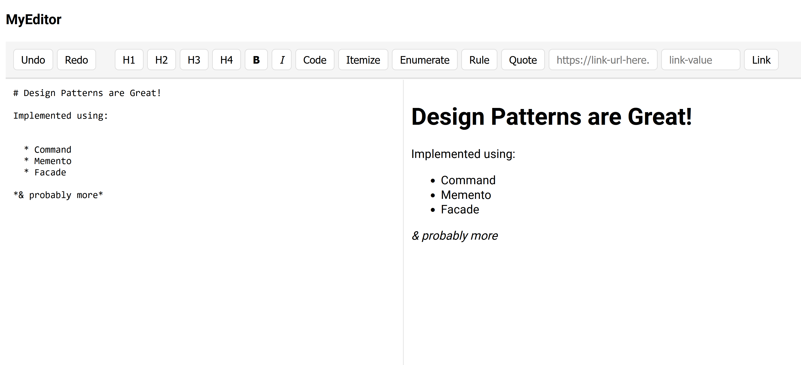
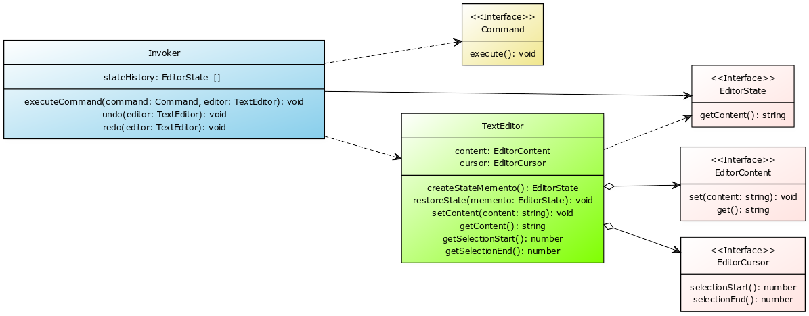

# adp-exercise-1

## 🚀 Installation and Run

To get started, follow these steps:

1. Install dependencies:
    ```bash
    npm install
    ```

2. Run the application:
    ```bash
    npm run dev
    ```

Once the application is running, you can access the Markdown editor in your [browser](http://localhost:5173/).



****

### How We Came to the Idea:

In today's digital world, simplicity is key. That's why we decided to develop a Markdown editor. This tool is user-friendly, making it accessible even for those with limited technical knowledge. Markdown simplifies the content creation process by removing the need for complex formatting. Instead, it offers a straightforward environment similar to plain text, with only a few symbols for emphasis. This makes it easy for anyone to write and share content, regardless of their familiarity with coding languages. By creating a Markdown editor, we aim to help people express their ideas more efficiently, thereby enhancing productivity and communication across various fields.

### Core Functionalities:

- **Text Editing:** Users can edit text within the editor, allowing for the creation and modification of content.
- **Formatting Buttons:** The system provides buttons for various Markdown formatting options, simplifying text formatting for users.
- **Undo/Redo:** Users can undo or redo their actions, providing flexibility and allowing for correction of mistakes.

### Design Patterns Integration:

- **Command Pattern:** Separates user actions from formatting execution, enhancing flexibility.
- **Memento Pattern:** Saves text state to enable undo functionality, ensuring users can revert changes easily.
- **Facade Pattern:** Simplifies integration by providing an intuitive interface with text area and buttons.

### Basic Design Sketch:

A user interface displays a text area and buttons for formatting options. Clicking a button applies the chosen formatting to the text. Behind the scenes, design patterns ensure smooth interaction and undo capability.



In this system, the *Invoker* is responsible for receiving and executing user inputs by creating and executing *Commands*. Before executing each *Command*, the *Invoker* saves the current state of the *TextEditor* as an *EditorContent* using the Memento pattern. This allows for undo and redo functionality, as the system can revert to previous states of the *TextEditor*.

The *TextEditor* stores both the current content and cursor position, ensuring accurate representation of user interactions.

To provide easy integration of the editor in the used UI framework, a component called `MySvelteEditor` was created providing a new interface to simplify usage thus acting as a facade.

```svelte
<script>
	import MySvelteEditor from '../facade/MySvelteEditor.svelte';
</script>

<style></style>

<div class="...">
	<h3>MyEditor</h3>
	<!-- Facade for simple usage of "MyEditor" lib -->
	<MySvelteEditor/>
</div>
```

### Reflection:

The integration of design patterns was pivotal to our application's development. Selecting complementary patterns that did not feel forced was a considerable challenge. The Command pattern was our foundational choice, intriguing us with its versatility and compatibility with various ideas. This pattern, coupled with the Memento pattern, was frequently recommended in our research for their synergistic potential. So the idea of a string manipulation was born, which later evolved into a small Markdown editor for which Command and Memento pattern are perfect. Adding Markdown-specific formatting options such as headers are ideal candidates for a command, and the Memento pattern provides the basis for undo/redo operations that one expects from an editor.

Choosing the Facade pattern as our third component was inspired by our core idea of an editor. We aimed to create a simple, yet powerful interface akin to familiar tools like Word or Overleaf. This decision was further reinforced by our design philosophy to make the application accessible and intuitive. By encapsulating the library logic into a Svelte component, we aimed to mimic a tweakable library, allowing for potential extensions into other frameworks like React or Vue. We also debated if this use case is strictly speaking a Facade or maybe just a Adapter. We decided that is was a Facade as not incompatibility but simplicity was goal. The Facade pattern is primarily used to provide a simplified interface  to a complex system, library, or framework, making it easier for client code to interact with the system.

### Conclusion:

In conclusion, the implementation of our Markdown editor benefited greatly from using different design patterns. The Command pattern helped decouple user actions from formatting execution, making our code more flexible. Meanwhile, the Memento pattern proved useful for implementing the undo feature, allowing users to revert changes easily. Additionally, the Facade pattern simplified integration, making the editor more intuitive to use. This project was as much about overcoming design challenges as it was about technical implementation. It highlighted the significance of  thoughtful design and the careful selection of design patterns in creating software that is not only powerful but also accessible and easy to use.

****

**Group 5:**

- Ezequiel Bellver
- Kacper Urbaniec
- Rene Sorger

**Sources:**

* Slides
* [Command | Refactoring Guru](https://refactoring.guru/design-patterns/command)
* [Memento | Refactoring Guru](https://refactoring.guru/design-patterns/memento)
* [Facade | Refactoring Guru](https://refactoring.guru/design-patterns/facade)
* [Design Patterns: The Command Pattern | Wen Junhua](https://medium.com/@wenjh1998/design-patterns-the-command-pattern-4d0642e1e5ed)
